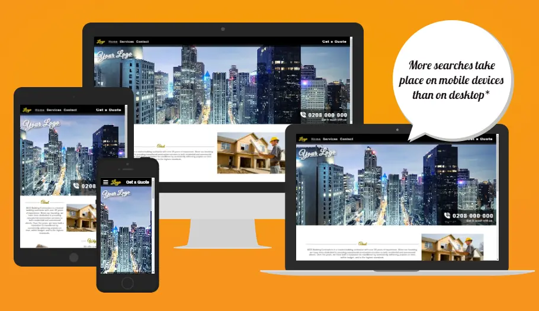

# BCG Building Contractor

BCG Building Contractor is a website project created to help showcase the services of a building firm. The website provides information about the various services that can be provided, such as kitchen installations, door fittings, architraves, fencing, roofing, loft extensions, and new builds. It aims to help potential clients find and contact the contractor online.

## Project Overview

This project is a simple website designed to showcase the services provided by a building contractor. The primary goal is to help the contractor reach a wider audience and make it easier for potential clients to get in touch. The website features a color scheme of gold and silver, complemented by black and grey tones, to create a professional and elegant look.

### Features

- **Consistent Header:** The header uses fixed positioning to remain consistent throughout the website. Originally, the navbar was intended to be displayed below the main image, but there were issues with using sticky positioning.
- **Responsive Design:** The navbar and logo adjust for smaller screens to ensure a great user experience across all devices.
- **Customizable Branding:** The logo and images used on the website can be easily changed to better suit the client's branding and preferences.
- **Stylish Design:** The website includes a slight 30% fade at the bottom of the header to enhance its appearance and blend seamlessly with the hero image.
- **Three Main Pages:** The website is structured around three main pages, providing clear and organized information about the contractor's services.

### Services Offered
- Kitchens
- Doors
- Architraves
- Fencing
- Roofing
- Loft Extensions
- Extensions
- New Builds

## Description

My original design placed the navbar at the bottom of the hero image, but I struggled to get it to work correctly with sticky positioning. This project began as a practice website, so my Git commits were not done as they should have been. I also made a lot of trial-and-error changes to get things working correctly and did not want these reflected in my commit messages. However, I now realize this approach was incorrect. I have since committed my web design and will commit any further changes properly.

The next step is to work on a landing page for the contact.html, so that clients will get a response after filling in the contact form. I will also be making some adjustments to the sizing and positioning of images and text on the service page.

## Testing

-

## Bugs

## Validator Testing

- HTML
  -   

- CSS 
  -

- Accessibility
  -

### Unfixed Bugs

-

## Deployment 

## Credits 

### Content

- The code for the css dropdown navbar was taken from the CI Love Running Project.

### Media 

- The images where taken from Google.

## Usage

To use the website, simply open it in a web browser. It is designed to be straightforward and user-friendly, providing visitors with information about the contractor's services and contact details.

---

Feel free to get in touch if you have any questions or need further information.
