# BCG Building Contractor

BCG Building Contractor is a website project created to help showcase the services of a building firm. The website provides information about the various services that can be provided, such as kitchen installations, door fittings, architraves, fencing, roofing, loft extensions, and new builds. It aims to help potential clients find and contact the contractor online.

**The deployed website can be found here:** [BCG Building Contractors](https://andyv773.github.io/bcg-test)

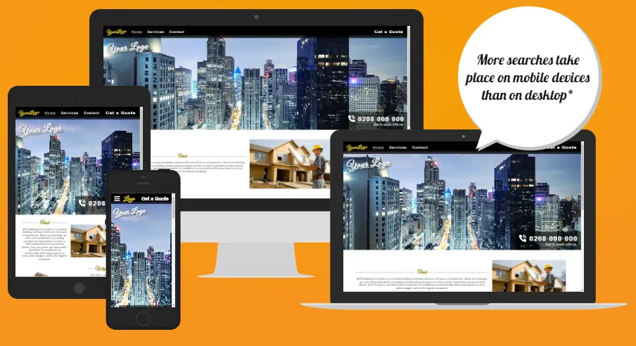

## Project Overview

This project is a website designed to showcase the services provided by a building contractor. The primary goal is to help the contractor reach a wider audience and make it easier for potential clients to get in touch. The website features a color scheme of gold and silver, complemented by black and grey tones, to create a professional and elegant look that goes well with the imported Google font "Great Vibes".

My original design placed the navbar at the bottom of the hero image, but I struggled to get it to work correctly with sticky positioning. This project began as a practice website, so my Git commits were not done as they should have been. I also made a lot of trial-and-error changes to get things working correctly and did not want these reflected in my commit messages. However, I now realize this approach was incorrect. I have since committed my web design and will commit any further changes properly.

Since I have also underlined the logo in the navbar this has not been updated in the images.

## Features

### Color Scheme

- **The site uses the following colors:**
  - Black: #000000
  - Onyx: #404040
  - Silver: #CCCCCC
  - White: #FFFFFF
  - Old Gold: #CCBB00

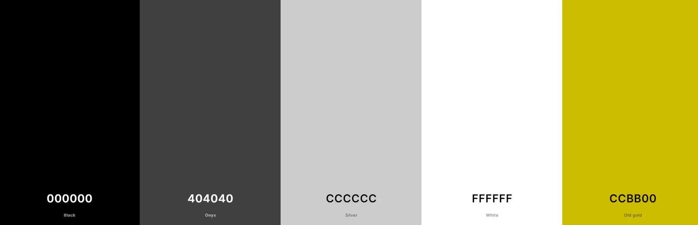

This color pallet was made in [Coolors](coolors.co)

I also used [W3S color picker](https://www.w3schools.com/colors/colors_picker.asp) to help find the colors, and hex numbers i was after.

### Header

The primary purpose of the header is to provide easy navigation across the website. A key feature is the "Get a Quote" link located at the top right corner, which directs potential customers to the contact page.

- **Consistent Header:** The header uses fixed positioning to remain consistent throughout the website. Originally, the navbar was intended to be displayed below the main image, but there were issues with using sticky positioning.
- **Customizable Branding:** The logo and images used on the website can be easily changed to better suit the client's branding and preferences.
- **Stylish Design:** The website includes a slight 30% fade at the bottom of the header to enhance its appearance and blend seamlessly with the hero image.
- **Three Main Pages:** The website is structured around three main pages, providing clear and organized information about the contractor's services. It is collapsible on small devices to take up less room, along with the client branding.

- **Responsive Design:** The navbar and logo adjust for smaller screens to ensure a great user experience across all devices.

### Footer

The footer is a significant part of the website, designed to be consistent across all three pages and providing comprehensive information. It consists of several sections, each serving a specific purpose:

- **Our Services section:** 
  - This section lists all the services offered by the contractor.
  - Each service is linked to the corresponding section on the service page for easy navigation.

- **Contact Section:** 
  - Contains all the client's contact details including address, company number, phone number, and email.
  - All contact details are interactive, allowing users to click to call or send an email directly.

- **Social Section:** 
  - Displays relevant social media information and links.
  - Helps users connect with the contractor on various social media platforms.

- **Copyright Information:** 
  - Located at the bottom of the footer, this section includes copyright details.
  - A small navigation menu is also included for quick access to other parts of the site.

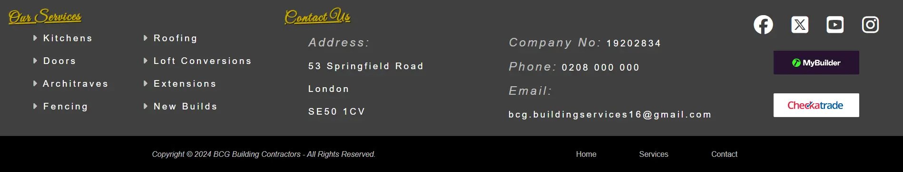

- **Design and Accessibility**

  - **Two-Tone Design:** The footer is designed with two tones to visually separate the lower footer, enhancing the overall look and readability.
  - **Responsive Design:** The footer is optimized to look good and function well on all devices, ensuring a consistent user experience across desktops, tablets, and smartphones.

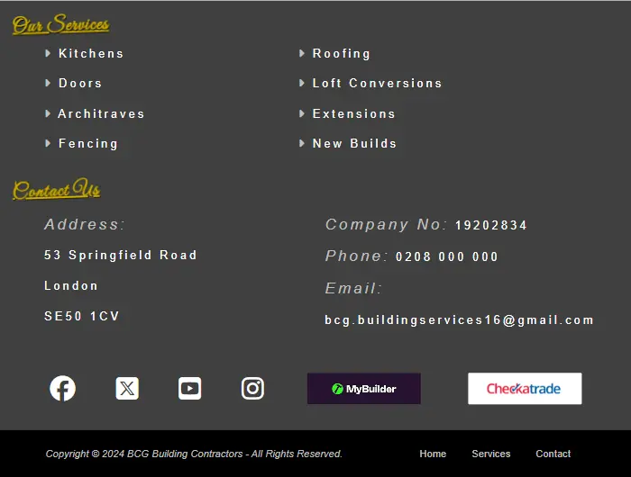

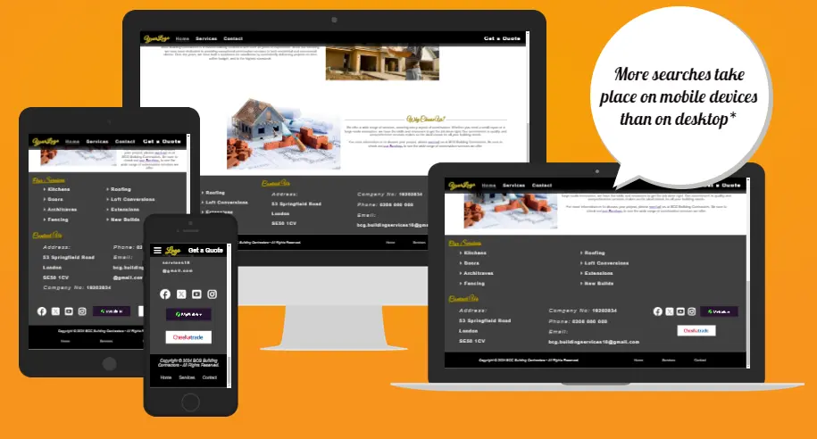

Significant effort was dedicated to designing and implementing the footer to ensure it is both informative and visually appealing. This part of the project took up most of the development time due to the attention to detail and the need for comprehensive functionality.

### Home Page

The home page is designed to engage visitors and provide them with essential information about the contractor and the services offered. It includes the following features and sections:

- **Hero Image:** A captivating hero image is displayed at the top of the page to catch visitors' eyes. The logo is positioned at the top left corner of the hero image, and an interactive phone number is located at the bottom right corner. The phone number includes an animated phone icon that moves every 8 seconds to attract attention.
  
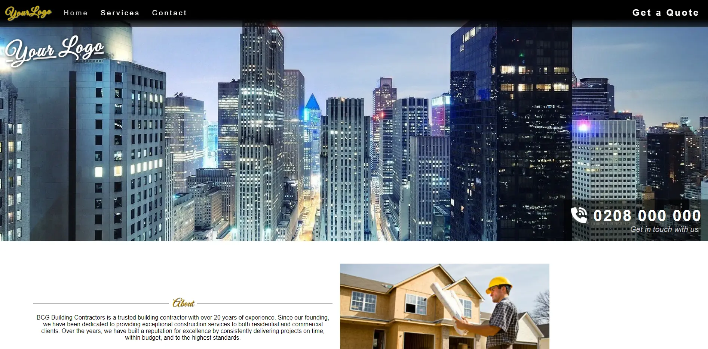

- **Reasons Section:**
  - **About Me:** This section provides some information about the contractor, including their background, expertise, and values. It features an image to help personalize the introduction.
  - **Why Choose Us:** This section outlines the key reasons why potential clients should choose the contractor. It highlights unique selling points and benefits, accompanied by an image to enhance visual appeal. Additionally, it includes two anchor tags: one that takes you to the contact page and another that takes you to the services page.

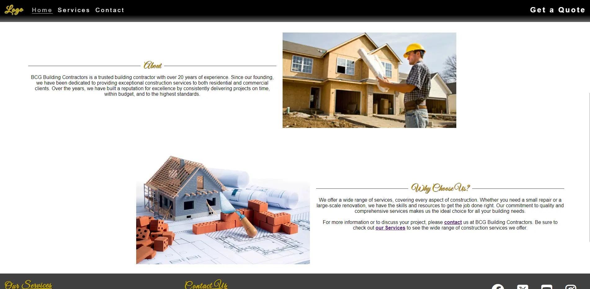  

### Services Page

The service page is aimed at providing a brief description of the different services offered by the contractor. Each service is presented with an image and a breif description to give potential clients a clear understanding of what is available.

- **Services Offered:**
  - Kitchens
  - Doors
  - Architraves
  - Fencing
  - Roofing
  - Loft Extensions
  - Extensions
  - New Builds

- **Main Image:** At the top of the service page, there is a large image similar to the home page, but reduced in height. The logo is positioned at the top left corner, and an interactive phone number is located at the bottom right corner with animated phone icon.

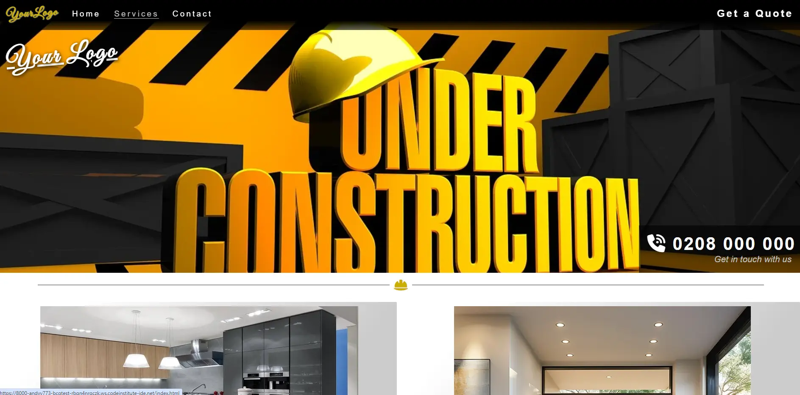

- **Design:** The page is designed using a table format to organize the content effectively, with a faded background to enhance readability and visual appeal. Each service includes an icon to the left, making it easy to identify. The information is overlined with a fieldset with a legend title for clear categorization. Service descriptions include unordered list items to highlight key points or features. Each service description includes a "Get in Touch" link that takes potential customers to the contact section, facilitating easy communication and inquiries.

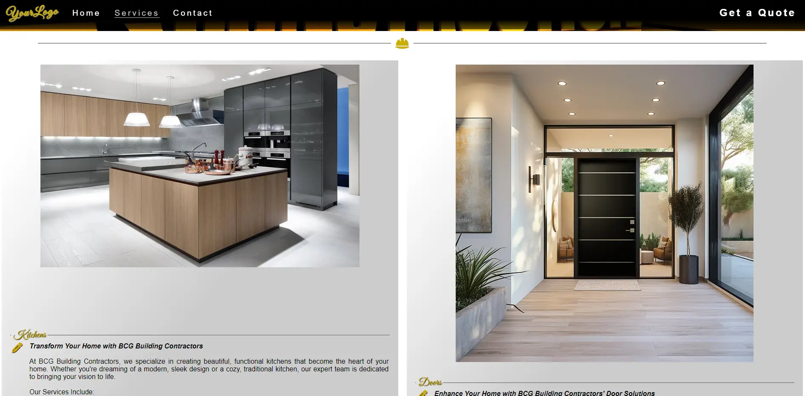

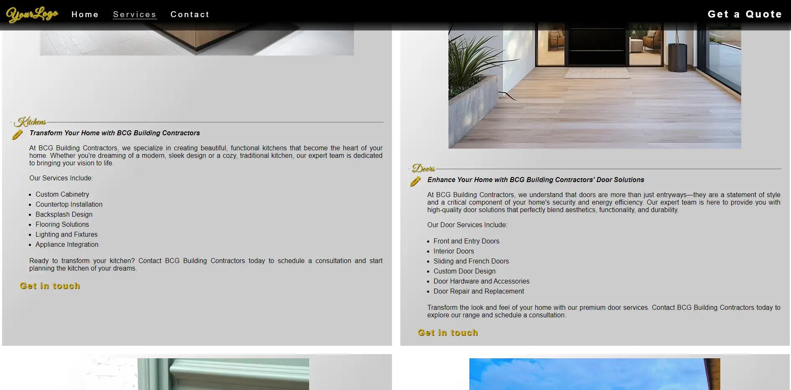

- **Responsive Design:**

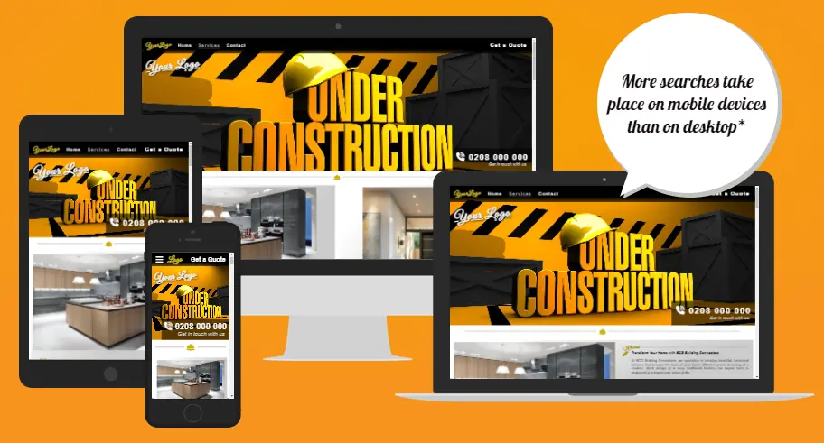

### Contact Page

- **Contact Page:** The contact page is designed to facilitate easy and painless communication between potential customers and the client. It offers multiple options to get in touch, including an interactive phone number, an interactive email link, a form for customers to fill in their details, and a map showing the client's location. Additionally, all the footer information is available on this page.

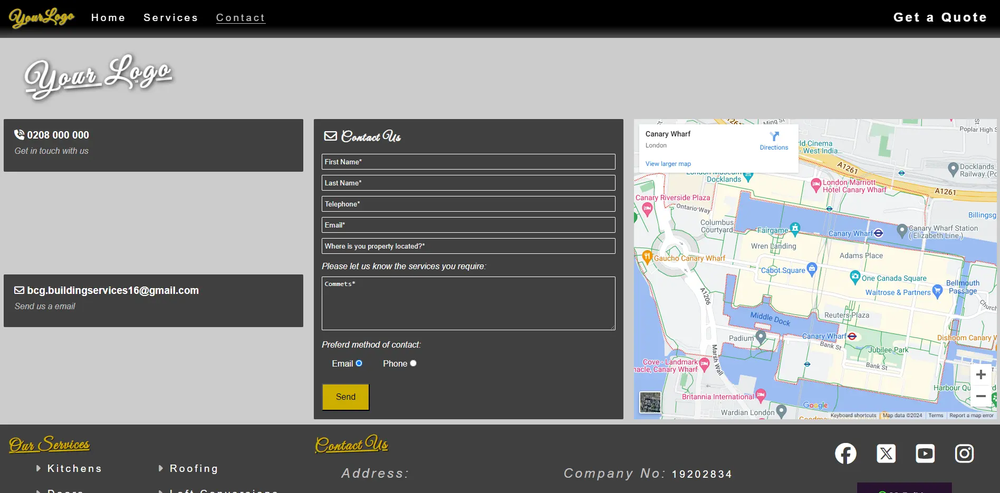

- **Submit Page:** The form is linked to a submit page that thanks the customer for their interest and informs them that the client will get back in touch as soon as possible. This is achieved by adding a dummy page and wrapping the form button in an anchor tag. Although this approach is not best practice and causes an error in the CSS validator, it was done for demonstration purposes only. The submit page retains the rest of the contact page information, allowing customers to explore other contact options if they need immediate assistance. A link is also provided to return to the home page.

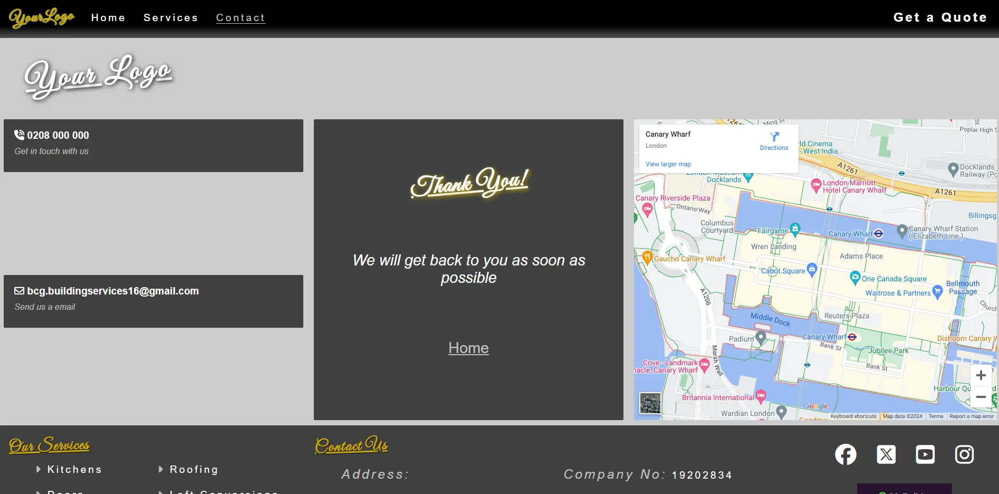

- **Responsive Design:**

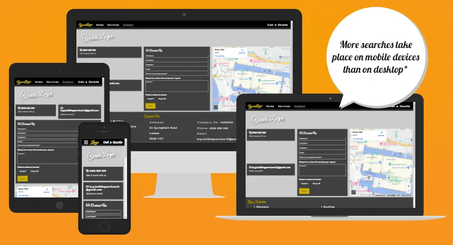

## Manual Testing

I have conducted thorough manual testing of the website to ensure all links and functionalities are working as intended. The following steps outline the testing process:

- **Header & Home Page:**
  - Verified that the "Get a Quote" link in the header navigates to the contact page.
  - Ensured that all other links in the header work as they should.
  - Tested the internal links in the "Why Choose Us" section to ensure they navigate to the contact and service pages.

- **Service Page:**
  - Verified that the main image phone number and logo links work as they should.
  - Checked that the "Get in Touch" links and images navigate to the contact section.

- **Contact Page:**
  - Ensured the interactive phone number and email links are functional.
  - Submitted the contact form to verify redirection to the thank you page. Also tested that the form works correctly with the Code Institute form dump web page.
  - Verified the map displays the correct location.

- **Footer:**
  - Verified that all service links in the footer navigate to the appropriate sections on the service page.
  - Confirmed that contact details and social media links are functional.
  - Checked that the small navigation menu in the lower footer is working correctly.

Through this comprehensive manual testing, I have ensured that all links are operational and the website provides a great user experience.

## Validator Testing

### HTML

- The website's HTML has passed the offical HTML Validator, ensuring that there are no issues and complys with web standards.
  - [W3C validator](https://validator.w3.org/nu/?doc=https%3A%2F%2Fandyv773.github.io%2Fbcg-test%2F)

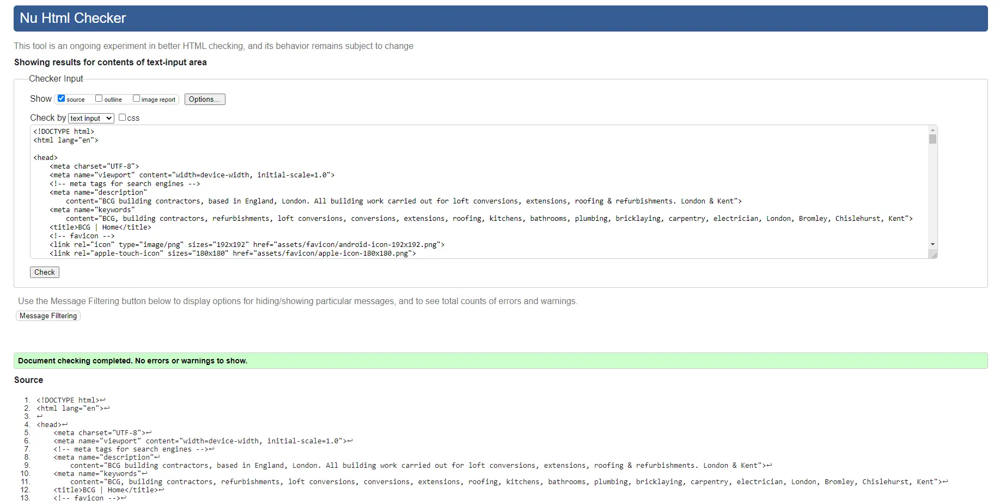  

- **Contact Page:** There is an anchor wrapped around the form button, linking to the submit page. This bypasses all the form requirements and causes an error in the HTML validator, but it is only there for dummy purposes.

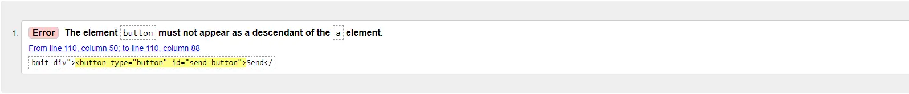

### CSS 

- The website's CSS has passed the offical CSS Validator, ensuring that there are no issues and complys with web standards.
  - [(Jigsaw) validator](https://jigsaw.w3.org/css-validator/validator?uri=https%3A%2F%2Fandyv773.github.io%2Fbcg-test&profile=css3svg&usermedium=all&warning=1&vextwarning=&lang=en) 

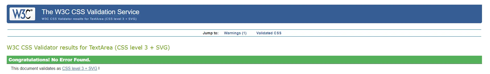

   

- There is one warning regarding the imported stylesheet from Google Fonts, but this does not affect the functionality or appearance of the website.

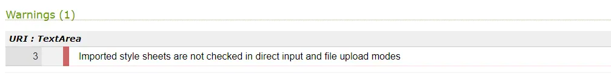

### Lighthouse Testing

#### Accessibility

- Home
  - I have made sure that the website has achieved a 100% accessibility score in Lighthouse testing, ensuring it is user-friendly and accessible to all visitors.
  - To do this I adjusted text colors/shadows, backgrounds and button sizes.

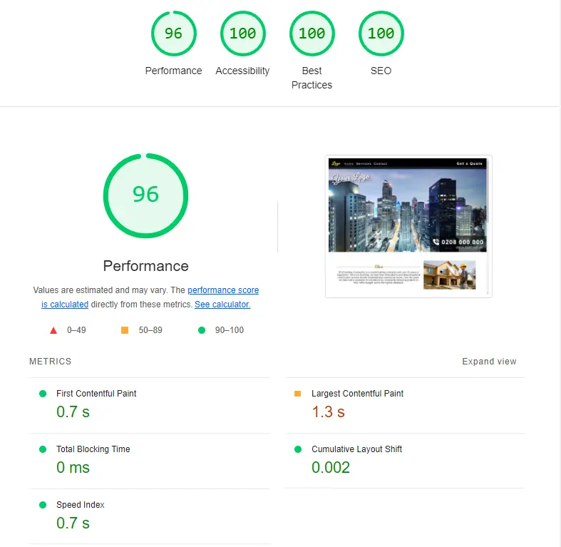

- Services

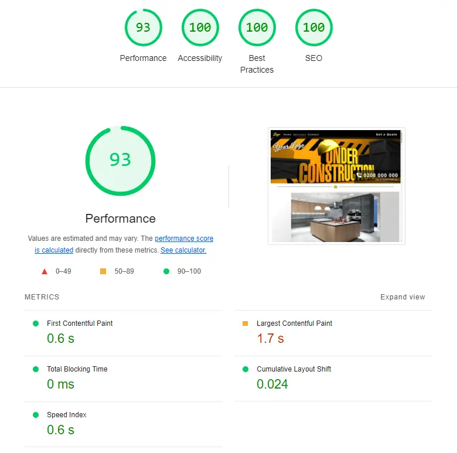

- Contact
  - The Best Practices score for the contact page is lower due to the iframes maps, and cookies, which will be looked into at a later date.

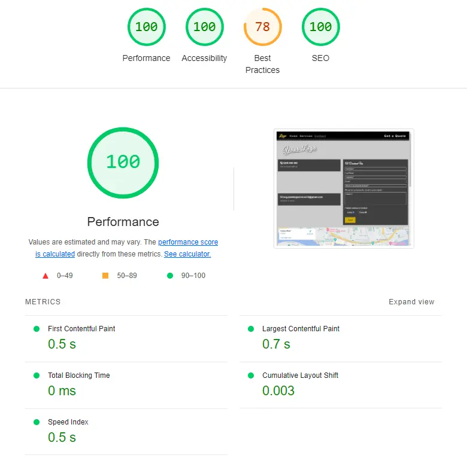

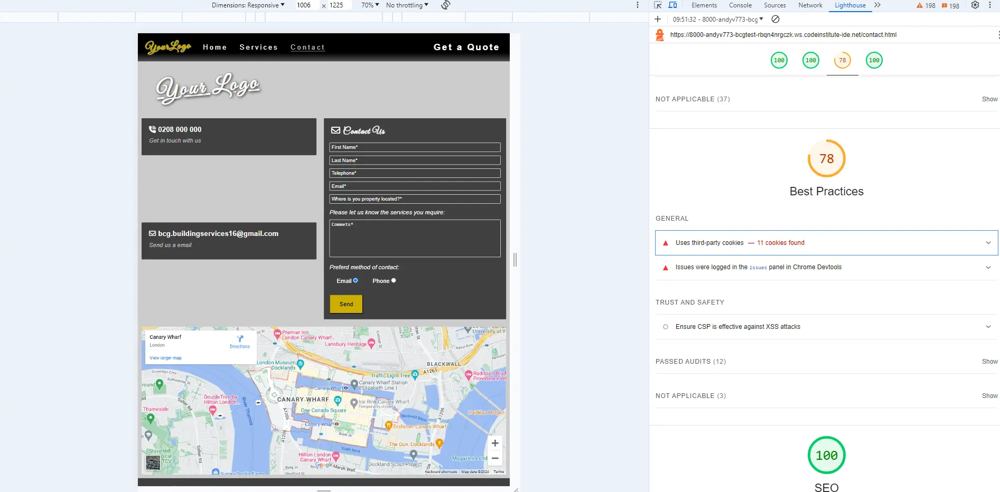

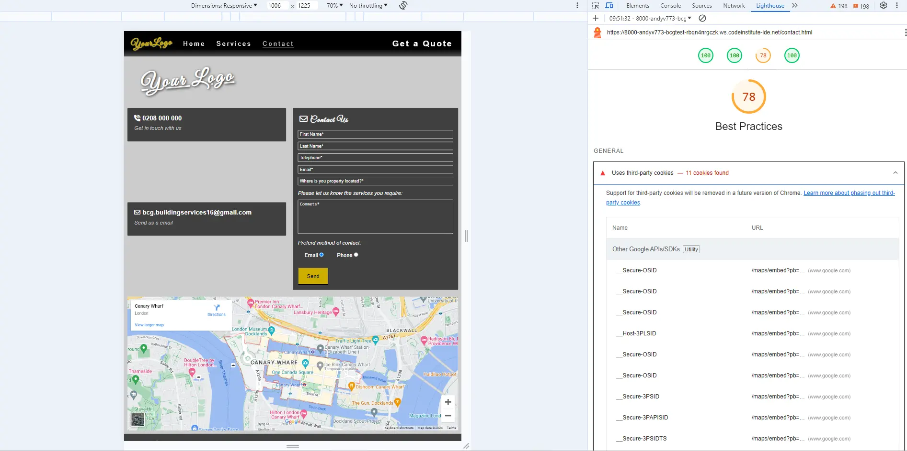

### Fixed Bugs

The first fix I made, once running the HTML validator, was to replace the "</li>" closing tag in the footer with the "</ul>" closing tag. I also added a semicolon to the symbol in the copyright section.

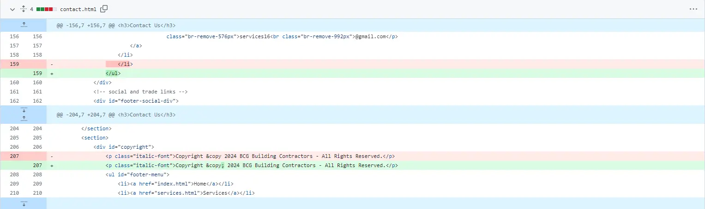

The next issues that I had in the HTML validator were whitespaces in the href phone number and an H1 issue.

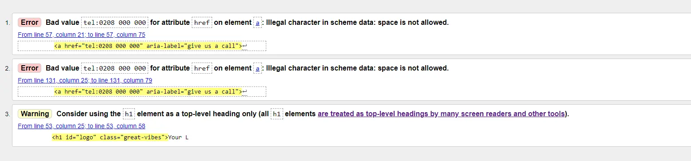

To fix this, I removed the white spaces and replaced the H1 with an H2.

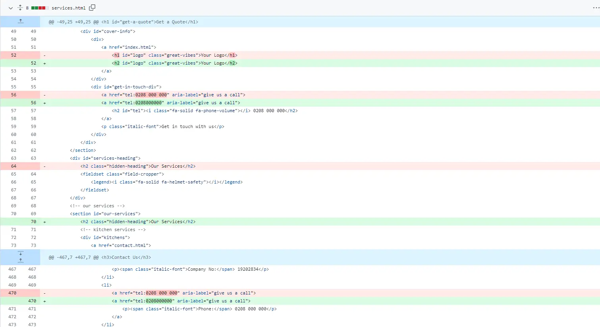

I later reduced the number of headings and replaced them with "p" tags with IDs. I also adjusted the CSS code to fit, creating a better hierarchy for screen readers.

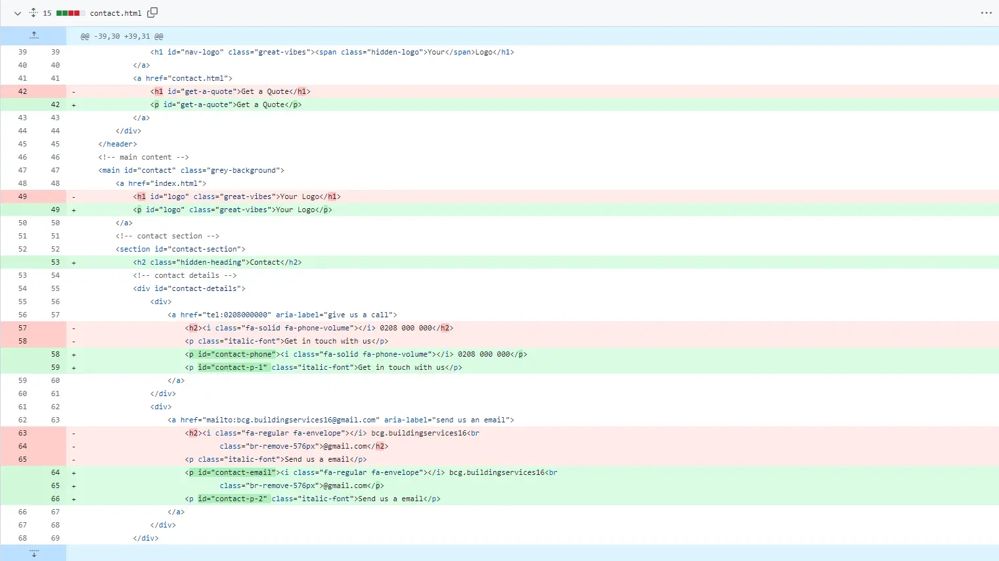

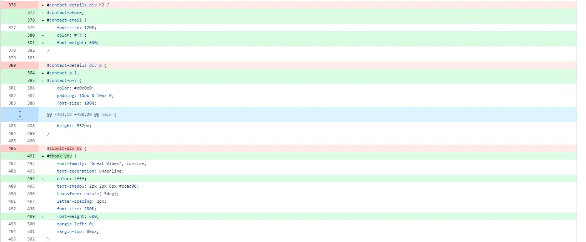

### Unfixed Bugs

- **Contact Page:**
  - Iframes map, Best Practices.

## Wireframe

I experimented with Balsamiq but found it to be more of a learning curve than a necessity for this project. I preferred diving straight into HTML and CSS. However, I did create some wireframes in Balsamiq to outline the website layout. Here are a few images of those wireframes.

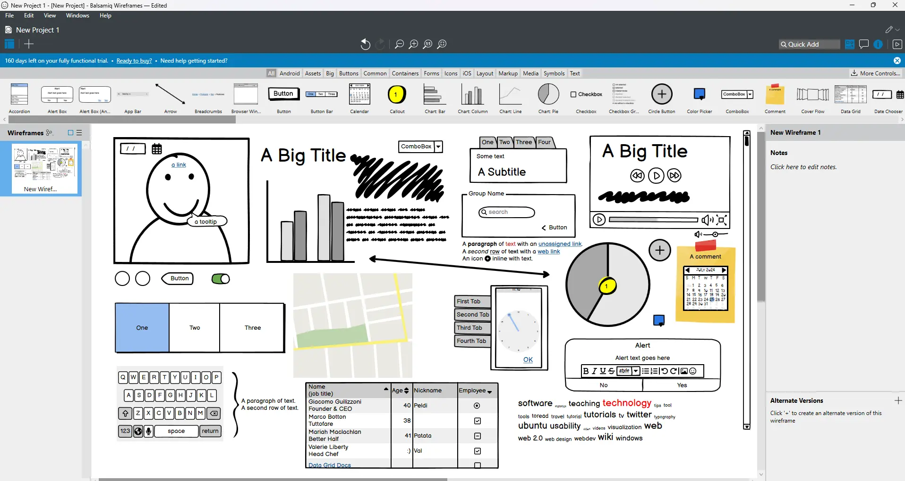

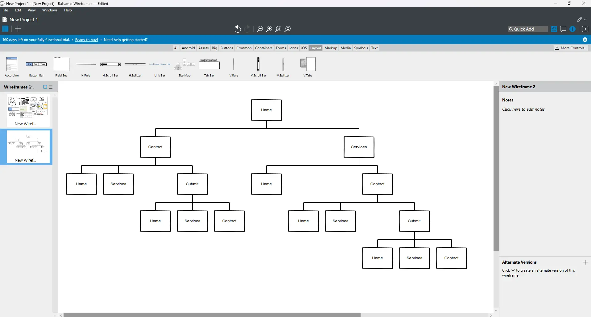

## Deployment

The site has been deployed to GitHub pages on GitHub.

- The steps to deploy are as follows:
  - In the [GitHub Repository](https://github.com/AndyV773/bcg-test), navigate to the Settings tab
  - In settings select pages in the left hand menu, select source deploy from branch
  - Branch should be main and select from root, then click "Save"
  - Once this has been selected and saved, the site should refresh. At the top of GitHub pages section, there will be a link to the site indicating the successful deployment.

**The deployed website can be found here:** [BCG Building Contractors](https://andyv773.github.io/bcg-test)   

## Credits 

### Content

- The code for the CSS dropdown navbar was taken from the [CI Love Running Project](https://code-institute-org.github.io/love-running-2.0/index.html).
- The icons used in the website come from [Font Awesome](https://fontawesome.com/).

### Media 

- The Favicon icon was generated using [Ionos](https://www.ionos.co.uk/tools/favicon-generator).
- The images have been optimised for the web and converted to .webp using [Free Convert](https://www.freeconvert.com/webp-converter).
- The images where taken from Google.

## Usage

To use the website, simply open it in a web browser. It is designed to be straightforward and user-friendly, providing visitors with information about the contractor's services and contact details.

---

Feel free to get in touch if you have any questions or need further information.
