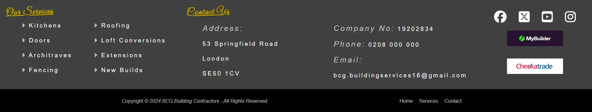

# BCG Building Contractor

BCG Building Contractor is a website project created to help showcase the services of a building firm. The website provides information about the various services that can be provided, such as kitchen installations, door fittings, architraves, fencing, roofing, loft extensions, and new builds. It aims to help potential clients find and contact the contractor online.

## Project Overview

This project is a simple website designed to showcase the services provided by a building contractor. The primary goal is to help the contractor reach a wider audience and make it easier for potential clients to get in touch. The website features a color scheme of gold and silver, complemented by black and grey tones, to create a professional and elegant look.

## Features

### Header

- **Consistent Header:** The header uses fixed positioning to remain consistent throughout the website. Originally, the navbar was intended to be displayed below the main image, but there were issues with using sticky positioning.
- **Responsive Design:** The navbar and logo adjust for smaller screens to ensure a great user experience across all devices.
- **Customizable Branding:** The logo and images used on the website can be easily changed to better suit the client's branding and preferences.
- **Stylish Design:** The website includes a slight 30% fade at the bottom of the header to enhance its appearance and blend seamlessly with the hero image.
- **Three Main Pages:** The website is structured around three main pages, providing clear and organized information about the contractor's services.

### Footer

The footer is a significant part of the website, designed to be consistent across all three pages and providing comprehensive information. It consists of several sections, each serving a specific purpose:

- **Our Services section:** 
  - This section lists all the services offered by the contractor.
  - Each service is linked to the corresponding section on the service page for easy navigation.

- **Contact Section:** 
  - Contains all the client's contact details including address, company number, phone number, and email.
  - All contact details are interactive, allowing users to click to call or send an email directly.

- **Social Section:** 
  - Displays relevant social media information and links.
  - Helps users connect with the contractor on various social media platforms.

- **Copyright Information:** 
  - Located at the bottom of the footer, this section includes copyright details.
  - A small navigation menu is also included for quick access to other parts of the site.

#### Design and Accessibility

- **Two-Tone Design:** The footer is designed with two tones to visually separate different sections, enhancing the overall look and readability.
- **Responsive Layout:** The footer is optimized to look good and function well on all devices, ensuring a consistent user experience across desktops, tablets, and smartphones.

Significant effort was dedicated to designing and implementing the footer to ensure it is both informative and visually appealing. This part of the project took up most of the development time due to the attention to detail and the need for comprehensive functionality.

### Home Page

The home page is designed to engage visitors and provide them with essential information about the contractor and the services offered. It includes the following features and sections:

- **Hero Image:** A captivating hero image is displayed at the top of the page to catch visitors' eyes. The logo is positioned at the top left corner of the hero image, and an interactive phone number is located at the bottom right corner. The phone number includes an animated phone icon that moves every 8 seconds to attract attention.
  

- **Reasons Section:**
  - **About Me:** This section provides some information about the contractor, including their background, expertise, and values. It features an image to help personalize the introduction.
  - **Why Choose Us:** This section outlines the key reasons why potential clients should choose the contractor. It highlights unique selling points and benefits, accompanied by an image to enhance visual appeal. Additionally, it includes two anchor tags: one that takes you to the contact page and another that takes you to the services page.

  

### Services Offered
- Kitchens
- Doors
- Architraves
- Fencing
- Roofing
- Loft Extensions
- Extensions
- New Builds

## Description

My original design placed the navbar at the bottom of the hero image, but I struggled to get it to work correctly with sticky positioning. This project began as a practice website, so my Git commits were not done as they should have been. I also made a lot of trial-and-error changes to get things working correctly and did not want these reflected in my commit messages. However, I now realize this approach was incorrect. I have since committed my web design and will commit any further changes properly.

The next step is to work on a landing page for the contact.html, so that clients will get a response after filling in the contact form. I will also be making some adjustments to the sizing and positioning of images and text on the service page.

## Testing

-

## Bugs

## Validator Testing

### HTML

- The website's HTML has passed the offical HTML Validator, ensuring that there are no issues and complys with web standards.
  - [W3C validator](https://validator.w3.org/nu/?doc=https%3A%2F%2Fandyv773.github.io%2Fbcg-test%2F)

    

### CSS 

- The website's CSS has passed the offical CSS Validator, ensuring that there are no issues and complys with web standards.
  - [(Jigsaw) validator](https://jigsaw.w3.org/css-validator/validator?uri=https%3A%2F%2Fandyv773.github.io%2Fbcg-test&profile=css3svg&usermedium=all&warning=1&vextwarning=&lang=en) 

   

- There is one warning regarding the imported stylesheet from Google Fonts, but this does not affect the functionality or appearance of the website.

### Accessibility

- Home

- Services

- contact 

### Unfixed Bugs

-

## Deployment 

## Credits 

### Content

- The code for the css dropdown navbar was taken from the CI Love Running Project.

### Media 

- The images where taken from Google.

## Usage

To use the website, simply open it in a web browser. It is designed to be straightforward and user-friendly, providing visitors with information about the contractor's services and contact details.

---

Feel free to get in touch if you have any questions or need further information.
